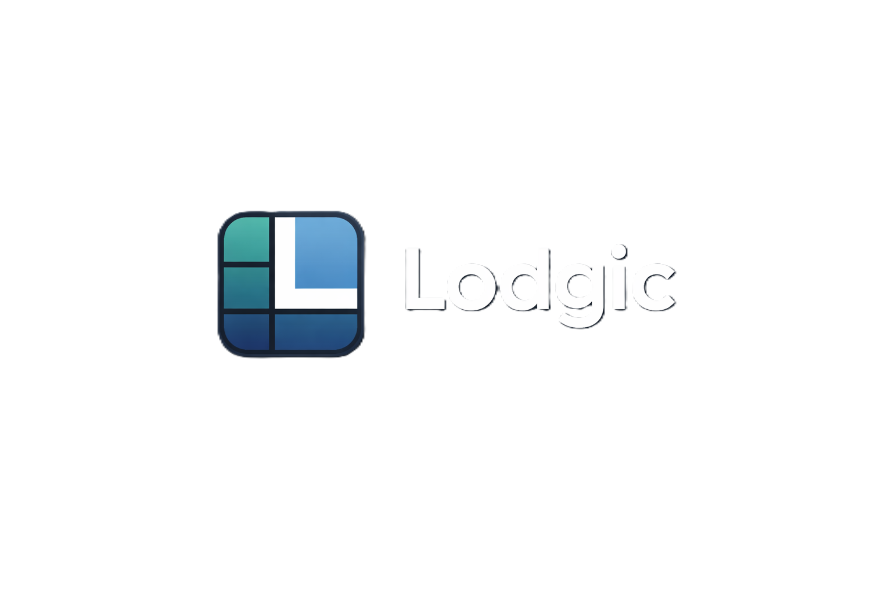
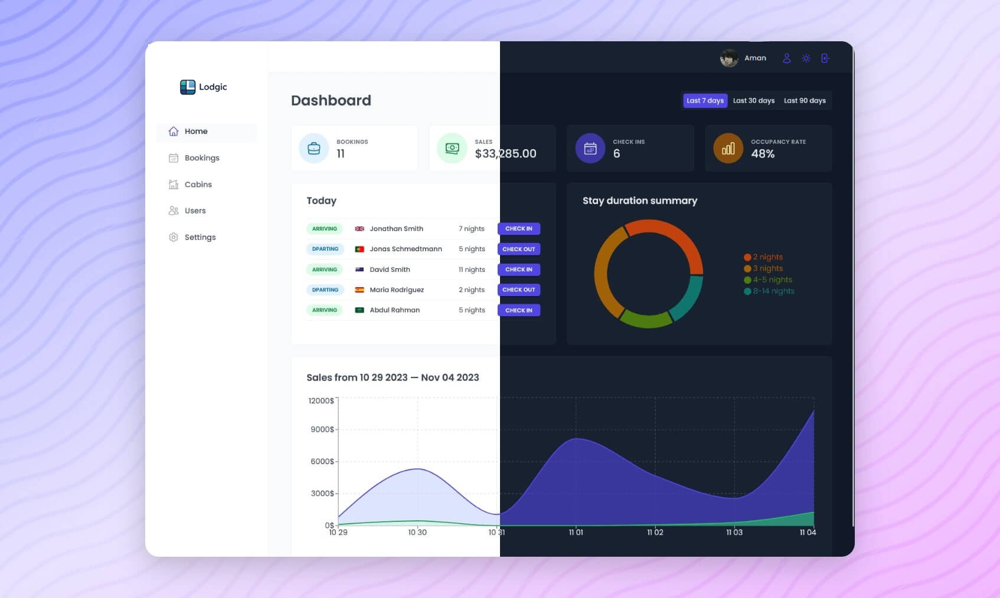

  

  <h1>Lodgic - Booking & Operations System</h1>

  <h3>
    <a href="https://lodgic-app.netlify.app/">
      <strong>Live Site</strong>
    </a>
  </h3>

  

        <a href="https://lodgic-app.netlify.app/">View website</a>
        •
        <a href="https://github.com/amankushwahacodes/lodgic/issues">Report Bug</a>
        •
        <a href="https://github.com/amankushwahacodes/lodgic/pulls">Request Feature</a>
  

  

<!-- Badges -->

<!-- Brief -->

<b> Lodgic </b> is a full-stack booking and operations management system designed for lodging businesses.
It enables hotel staff to manage reservations, cabins, check-ins, users, and operational insights from a single platform.

<!-- Screenshot -->

## Authentication & User Management
- Secure authentication ensures only authorized hotel employees can access the system
- Employees can manage their profiles, including avatar uploads and password updates

## Operations & Dashboard
- Centralized overview displaying key operational metrics:
  - Bookings
  - Check-ins
  - Sales
  - Occupancy rate

- Interactive charts and visual analytics for better operational insights

## Core Features

**Cabin Management**
- Create, update, and delete cabin records with real-time availability updates

**Booking Management**
- Manage reservations, check guests in and out, and update booking statuses

**Real-time Sync**
- Cabins and bookings update instantly across the app using Supabase

**Dark Mode**
- Fully supported dark mode for improved usability and accessibility

## Tech Stack

- **Frontend:** React, React Router, Styled Components
- **State & Data:** React Query
- **Backend & Auth:** Supabase (Database, Authentication, Real-time)
- **Forms:** React Hook Form
- **Charts:** Recharts
- **Build tool:** Vite

## Engineering Highlights

- Implemented secure authentication workflows using Supabase
- Designed real-time data synchronization for bookings and cabin availability
- Built reusable and scalable UI components using modern React patterns
- Managed asynchronous data fetching and caching with React Query
- Developed a theme-aware UI with full dark mode support

## Author

<b>👤 Aman Kushwaha</b>

- LinkedIn - [@amankushwahacodes](https://www.linkedin.com/in/amankushwahacodes)
- GitHub - [@amankushwahacodes](https://github.com/amankushwahacodes)

Feel free to contact me with any questions or feedback!
